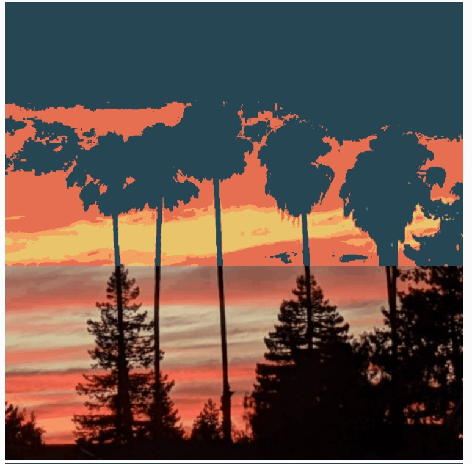
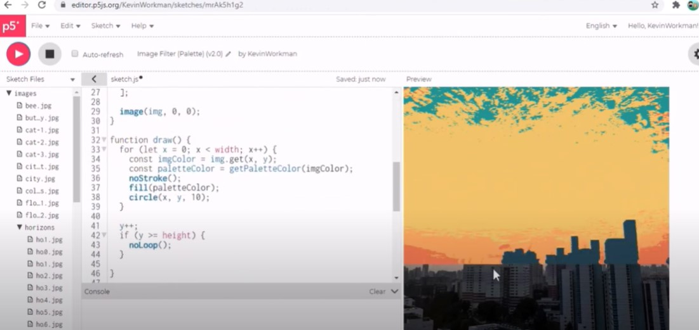

# rsmi0219_9103_tut8 - Quiz 8
IDEA9103 Creative Coding Robin Smits

## Part 1: Imaging Technique Inspiration

 
    Olafur Eliasson
    Room for one colour, 1997 

This artwork is an **optical illusion** with monofrequency light. This light changes everything to all yellow and black: all other colour perception disappears. What inspires me most about this artwork is that the colours of the light change the way you see the world around you. It makes you rethink what is real and what is not. For the animated version of the artwork from the assignment it would be really cool if it was possible to **interact with the perception of colours** of the artwork. This would be beneficial for the requirements since it would show an interesting digital interaction, since the artwork that we want to choose is very colourful.

>“ Every colour influences us in a different way. This is what art is: you are the co-author along with me. You are the lead character. What you see depends on you. ”

[Source: iGuzzini](https://www.iguzzini.com/lighthinking/olafur-eliasson-and-climate-change/)

[Source: docu-series Abstract (Olafur Eliasson: The Art of Design)](https://www.netflix.com/watch/80237093?trackId=255824129 )

## Part 2: Coding Technique Exploration 

#### Image Palette
Interactive filters could be applied to images. An example is [this](https://happycoding.io/tutorials/p5js/images/image-palette ) code in p5.js.

 With this code you can give images as input and it is able to output it with **only** the colours that you gave it. So you would be able to take away certain colours or make users drag and drop colours out of it maybe. This works by replacing the pixels of the image with pixels of the closest colour like we did in the Mona Lisa, but then simply using so many pixels so that it looks like the exact input image.

