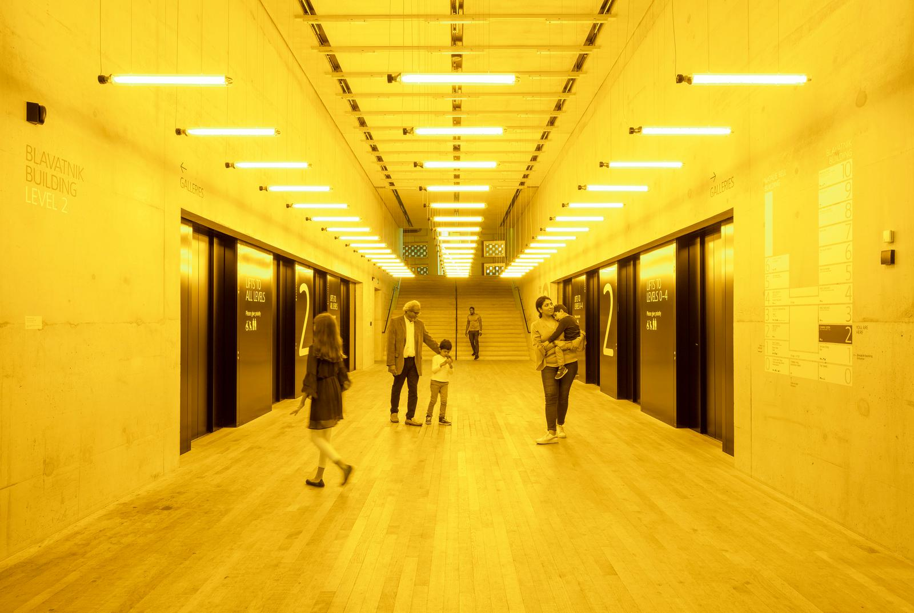
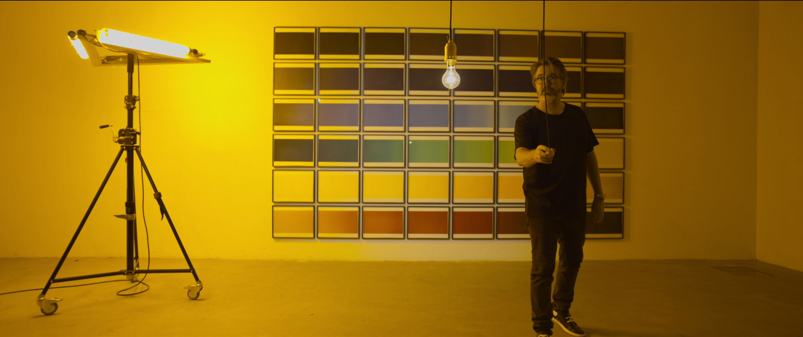

# rsmi0219_9103_tut8
IDEA9103 Creative Coding R Smits

## Part 1: Imaging Technique Inspiration

#### Olafur Eliasson 
###### Room for one colour, 1997 

     Text

### “every colour influences us in a different way. This is what art is: you are the co-author along with me. You are the lead character. What you see depends on you”
###### https://www.iguzzini.com/lighthinking/olafur-eliasson-and-climate-change/ 
###### 

## Part 2: Coding Technique Exploration 

#### Image Palette
Interactive filters could be applied to images. An example is this code in p5.js: https://happycoding.io/tutorials/p5js/images/image-palette .

    With this code you can give images as input and it is able to output it with only the colours that you gave it. So you would be able to take away certain colours or make users drag and drop colours out of it maybe. This works by replacing the pixels of the image with pixels of the closest colour like we did in the Mona Lisa, but then simply using so may pixels so that it looks like the exact input image.

